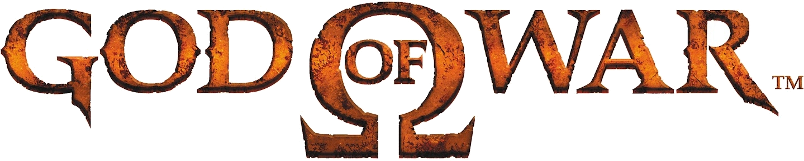

<h1 aling=center>Kratos's landing page</h1>

<h2>Contexto</h2>

Esse projeto se refere ao projeto final do meu primeiro treinamento acerca da progtamação front-end no ano de 2022, ano em que decidi que iria virar um desenvolvedor. 
Nesse projeto final temos vários recursos excelentes que vou desenvolver cada vez mais ao longo da minha carreira, principalmente a comunicação com uma API   
Portanto, pode-se afirmar que esse site corresponde à largada da minha carreira. A partir daqui, muitas coisas boas surgirão.

<h2 aling=center>Site</h2>

<h2 aling=center>Tratamento de erro na inserção de dados</h2>

<h2>Recursos</h2>
<ul>
    <li>html, css e javascript</li>
    <li>Framework: Bootstrap</li>
    <li>Uso de containers</li>
    <li>Validação de conteúdo na inserção de dados por parte do cliente</li>
    <li>Comunicação com API: inserção de dados no banco de dados</li>
    <li>Possível adaptação para um site de vendas</li>
</ul>